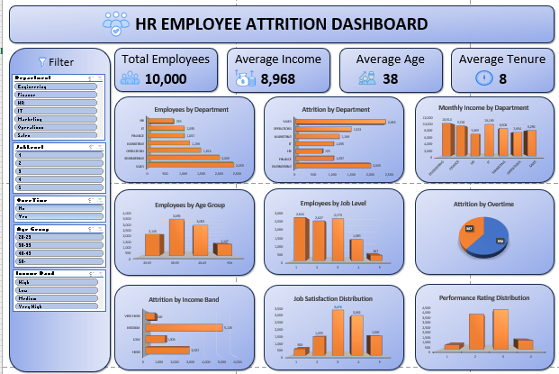

# HR Employee Attrition Dashboard (Microsoft Excel)

<p align="center">
  
</p>

## Project Overview

This project analyzes employee workforce data using Microsoft Excel. The dashboard provides insights into employee distribution, income, demographics, job levels, satisfaction, and overtime using PivotTables, PivotCharts, Slicers, and Excel formulas.

---

## Objectives

- Analyze employee demographics
- Compare employees across departments
- Understand salary distribution
- Explore job satisfaction levels
- Analyze overtime distribution
- Build an interactive Excel dashboard

---

## Tools Used

- Microsoft Excel
- Pivot Tables
- Pivot Charts
- Slicers
- Excel Tables
- IF Formulas
- Custom Calculated Columns

---

## Dataset

The dataset contains approximately **10,000 employee records** with information such as:

- Employee ID
- Department
- Age
- Monthly Income
- Job Level
- Years at Company
- Work-Life Balance
- Job Satisfaction
- Performance Rating
- Overtime
- Training Hours

---

## Data Cleaning

The dataset was prepared by:

- Converting the data into an Excel Table
- Checking for missing values
- Standardizing column names
- Creating helper columns:
  - Age Group
  - Income Band
  - Tenure Group
- Formatting numerical values

---

## Dashboard Features

The dashboard includes:

### KPI Cards

- Total Employees
- Average Income
- Average Age
- Average Tenure

### Interactive Filters

- Department
- Job Level
- Overtime
- Age Group
- Income Band

### Visualizations

- Employees by Department
- Monthly Income by Department
- Employees by Age Group
- Employees by Job Level
- Job Satisfaction Distribution
- Performance Rating Distribution
- Overtime Distribution
- Income Band Distribution

---

## Dashboard Preview

<p align="center">
  
</p>

---

## Folder Structure

```
HR_Analytics_Excel/
│
├── Dataset/
│   └── Employee_Attrition_DataSet.xlsx
│
├── Dashboard/
│   └── HR_Analytics.xlsx
│
├── Images/
│   ├── Dashboard.png
│   ├── Pivot_Tables.png
│   └── Data_Cleaning.png
│
└── README.md
```

---

## Skills Demonstrated

- Excel Data Cleaning
- Pivot Tables
- Pivot Charts
- Dashboard Design
- Data Visualization
- Interactive Reporting
- Data Analysis
- KPI Reporting

---

## Author

**Dwight Baines F. Camposano**

GitHub:
https://github.com/waytie
